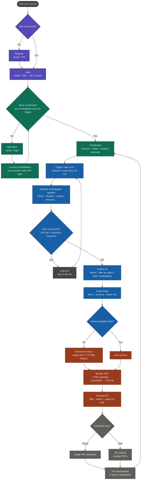

# Laco Invoice — User Journey

```mermaid
flowchart TD
    START([Visit Laco Invoice])

    %% ── AUTH ──
    START --> HAS_ACCOUNT{Has an account?}
    HAS_ACCOUNT -- No --> REGISTER[Register\nemail + PW]
    REGISTER --> LOGIN
    HAS_ACCOUNT -- Yes --> LOGIN[Login\nemail + PW → JWT issued]

    %% ── SETUP ──
    LOGIN --> STORE_CONNECTED{Store connected?\nany marketplace account linked}
    STORE_CONNECTED -- No --> ADD_STORE[Add store\nname + logo]
    ADD_STORE --> CONNECT_MKT[Connect marketplace\npick provider, enter API keys]
    CONNECT_MKT --> STORE_CONNECTED
    STORE_CONNECTED -- Yes --> DASHBOARD[Dashboard\nrevenue · orders · invoices summary]

    %% ── SYNC ──
    DASHBOARD --> TRIGGER_SYNC[Trigger order sync\nmanual or auto every 10 min]
    TRIGGER_SYNC --> RESOLVE_ADAPTER[Resolve marketplace adapter\nTikTok · Shopee · Lazada · Amazon…]
    RESOLVE_ADAPTER --> SYNC_OK{Sync successful?\nAPI call + normalize response}
    SYNC_OK -- Fail --> LOG_ERROR[Log error\nretry in 30 min]
    LOG_ERROR --> TRIGGER_SYNC

    %% ── ORDERS ──
    SYNC_OK -- OK --> ORDERS_LIST[Orders list\nsearch · filter by status / date / marketplace]
    ORDERS_LIST --> ORDER_DETAIL[Order detail\nitems · amounts · buyer info]
    ORDER_DETAIL --> INV_EXISTS{Invoice already exists?}

    %% ── INVOICE ──
    INV_EXISTS -- Yes --> VIEW_INV[View invoice]
    INV_EXISTS -- No --> GEN_INV[Generate invoice\nassign INV-YYYYMM-000001]
    GEN_INV --> RENDER_PDF[Render PDF\nHTML template → ChromeDP → PDF file]
    VIEW_INV --> RENDER_PDF
    RENDER_PDF --> INV_LIST[Invoices list\nfilter · search · select for bulk]

    %% ── EXPORT ──
    INV_LIST --> DL_TYPE{Download type?}
    DL_TYPE -- Single --> SINGLE_PDF[Single PDF download]
    DL_TYPE -- Bulk --> BULK_ZIP[ZIP archive\nmultiple PDFs]
    SINGLE_PDF --> DONE[File downloaded\n↻ back to dashboard]
    BULK_ZIP --> DONE
    DONE --> DASHBOARD

    %% ── STYLES ──
    classDef auth    fill:#534AB7,stroke:#3C3489,color:#EEEDFE
    classDef setup   fill:#0F6E56,stroke:#085041,color:#E1F5EE
    classDef sync    fill:#185FA5,stroke:#0C447C,color:#E6F1FB
    classDef orders  fill:#185FA5,stroke:#0C447C,color:#E6F1FB
    classDef invoice fill:#993C1D,stroke:#712B13,color:#FAECE7
    classDef export  fill:#5F5E5A,stroke:#444441,color:#F1EFE8
    classDef neutral fill:#444441,stroke:#2C2C2A,color:#F1EFE8
    classDef error   fill:#444441,stroke:#2C2C2A,color:#F1EFE8

    class START neutral
    class HAS_ACCOUNT,REGISTER,LOGIN auth
    class STORE_CONNECTED,ADD_STORE,CONNECT_MKT,DASHBOARD setup
    class TRIGGER_SYNC,RESOLVE_ADAPTER,SYNC_OK sync
    class LOG_ERROR error
    class ORDERS_LIST,ORDER_DETAIL,INV_EXISTS orders
    class GEN_INV,RENDER_PDF,VIEW_INV,INV_LIST invoice
    class DL_TYPE,SINGLE_PDF,BULK_ZIP,DONE export
```